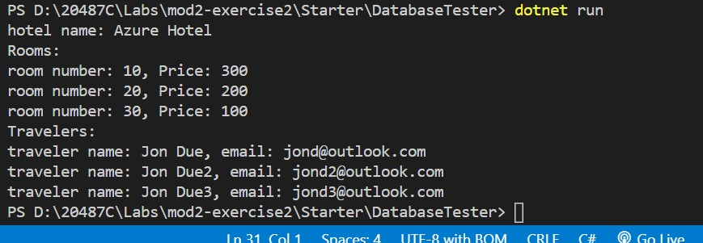

# Module 2: Querying and Manipulating Data Using Entity Framework

# Lab: Creating a Data Access Layer using Entity Framework

1. **Nombres y apellidos:** Francisco Javier Moreno Quevedo
2. **Fecha:** 17/01/2021
3. **Resumen del Ejercicio:**  Crear el modelo  el dbcontext el dbinitializer y un proyecto de prueba que extraiga la informacion
4. **Dificultad o problemas presentados y como se resolvieron:** Ninguna


#### Exercise 1: Creating a Data ModelCreamos un proyecto **ASP.NET Core Class Library**

- Creamos un proyecto **ASP.NET Core Class Library**

```bash
 dotnet new classlib --name DAL --output [Repository Root]\Allfiles\Mod02\LabFiles\Lab1\Starter\DAL
```

- añadimos los paquetes referenciados y restauramos

```base
 dotnet add package Microsoft.EntityFrameworkCore.SqlServer --version=2.1.1
 dotnet restore
```

- Añadimos la clase Traveller en **Traveler.cs**

```cs
 namespace DAL.Models
 {
     public class Traveler
     {
         public int TravelerId { get; set; }
         public string Name { get; set; }
         public string Email {get; set; }
     }
 }
```


- Añadimos la claseroom en **Room.cs**, 

```cs
 using System.Collections.Generic;

 namespace DAL.Models
 {
     public class Room
     {
         public int RoomId { get; set; }
         public int Number { get; set; }
         public decimal Price { get; set; }
         public bool Available { get; set; }
         public ICollection<Booking> Bookings { get; set; } = new List<Booking>();

     }
 }
```

- Alñadim os la clase Hotel en **Hotel.cs**,

```cs
 using System.Collections.Generic;

 namespace DAL.Models
 {
     public class Hotel
     {
         public int HotelId { get; set; }
         public string Name { get; set; }
         public string Address { get; set; }
         public ICollection<Room> Rooms { get; set; }
     }
 }
```

- Añadimos la clase Booking en **Booking.cs**,

```cs
 using System;

 namespace DAL.Models
 {
     public class Booking
     {
         public int BookingId { get; set; }
         public Room Room { get; set; }
         public DateTime DateCreated { get; set; }
         public DateTime CheckIn { get; set; }
         public DateTime CheckOut { get; set; }
         public int Guests { get; set; }
         public decimal TotalFee { get; set; }
         public bool Paid { get; set; }
         public Traveler Traveler { get; set; }
     }
 }
```

- Añadimos el contexto MyDbContext en **MyDbContext.cs**

  

  ```cs
  using Microsoft.EntityFrameworkCore;
  using DAL.Models;
  
  namespace DAL.Database
   {
       public class MyDbContext : DbContext
       {
           public DbSet<Traveler> Travelers { get; set; }
           public DbSet<Room> Rooms { get; set; }
           public DbSet<Booking> Bookings { get; set; }
           public DbSet<Hotel> Hotels { get; set;}
  
           private void InitialDBContext()
           {
               DbInitializer.Initialize(this);
           }
  
           // Default Constructor
           public MyDbContext()
           {
               InitialDBContext();
           }
  
           // Constructor with options
           public MyDbContext(DbContextOptions<MyDbContext> options)
                   : base(options)
           {
               InitialDBContext();
           }
  
           protected override void OnConfiguring(DbContextOptionsBuilder optionsBuilder)
           {
               if (!optionsBuilder.IsConfigured)
               {
                   optionsBuilder.UseSqlServer(@"Server=.\SQLEXPRESS;Database=Mod2Lab1DB;Trusted_Connection=True;");    
               }
           }
       }
   }
  ```

#### Exercise 2: Query your database

- Añadimos el DBInitializer en  **DbInitializer.cs** 	

```cs
 using System;
 using System.Collections.Generic;
 using DAL.Models;

namespace DAL.Database
 {
     public static class  DbInitializer
     {
         public static void Initialize(MyDbContext context)
         {
             if(context.Database.EnsureCreated())
             {
                 // Code to create initial data
                 Seed(context);
             }
         }

         private static void Seed(MyDbContext context)
         {
              // Create list with dummy Travelers
              List<Traveler> travelerList = new List<Traveler>
              {
                  new Traveler(){ Name = "Jon Due", Email = "jond@outlook.com"},
                  new Traveler(){ Name = "Jon Due2", Email = "jond2@outlook.com"},
                  new Traveler(){ Name = "Jon Due3", Email = "jond3@outlook.com"}
              };

              // Create list with dummy bookings
             List<Booking> bookingList = new List<Booking>
             {
                 new Booking()
                 {
                     DateCreated = DateTime.Now,
                     CheckIn = DateTime.Now,
                     CheckOut = DateTime.Now.AddDays(2),
                     Guests = 2,
                     Paid = true,
                     Traveler = travelerList[0]
                 },
                 new Booking()
                 {
                     DateCreated = DateTime.Now.AddDays(3),
                     CheckIn = DateTime.Now.AddDays(5),
                     CheckOut = DateTime.Now.AddDays(8),
                     Guests = 3,
                     Paid = true,
                     Traveler = travelerList[1]
                 },
                 new Booking()
                 {
                     DateCreated = DateTime.Now.AddDays(-10),
                     CheckIn = DateTime.Now.AddDays(10),
                     CheckOut = DateTime.Now.AddDays(11),
                     Guests = 1,
                     Paid = false,
                     Traveler = travelerList[2]
                 }
             };

              // Create list with dummy rooms
              List<Room> roomList = new List<Room>
              {
                  new Room(){ Number = 10, Price = 300},
                  new Room(){ Number = 20, Price = 200},
                  new Room(){ Number = 30, Price = 100}
              };

              roomList[0].Bookings.Add(bookingList[0]);
              roomList[1].Bookings.Add(bookingList[1]);
              roomList[1].Bookings.Add(bookingList[2]);

              Hotel hotel = new Hotel()
              {
                  Name = "Azure Hotel",
                  Address = "Cloud",
                  Rooms = roomList
              };

              // Insert the dummy data to the database
              context.Travelers.AddRange(travelerList);
              context.Bookings.AddRange(bookingList);
              context.Rooms.AddRange(roomList);
              context.Hotels.Add(hotel);

              context.SaveChanges();
         }
     }
 }
```

#### 

- Creamos un nuevo proyecto DatabaseTester del tipo **ASP.NET Core Console Application** 

```bash
 dotnet new console --name DatabaseTester --output [Repository Root]\Allfiles\Mod02\LabFiles\Lab1\Starter\DatabaseTester
```

- Creamos una nueva solucion 

```bash
 dotnet new sln --name Mod2Lab1
```

- Añadimos a la solucion los dos proyectos

```bash
 dotnet sln Mod2Lab1.sln add DAL\DAL.csproj
```

```bash
 dotnet sln Mod2Lab1.sln add DatabaseTester\DatabaseTester.csproj
```


- En **DatabaseTester.csproj** Añadimos la referencia al proyecto  **DAL** 

```xml
 <ItemGroup>
     <ProjectReference Include="..\DAL\DAL.csproj" />
 </ItemGroup>
```

- En **DatabaseTester** en el **Program.cs**, añadimos los using

   ```cs
    using DAL.Database;
    using DAL.Models;
    using System.Linq;
    using System.Collections.Generic;
   ```

- y en el main

   ```cs
    using (MyDbContext context = new MyDbContext())
    {
        DbInitializer.Initialize(context);

        Hotel hotel = context.Hotels.FirstOrDefault();
        Console.WriteLine($"hotel name: {hotel.Name}");

        Console.WriteLine("Rooms:");
        foreach (Room room in context.Rooms.ToList())
            Console.WriteLine($"room number: {room.Number}, Price: {room.Price}");

        Console.WriteLine("Travelers:");
        foreach (Traveler traveler in context.Travelers.ToList())
            Console.WriteLine($"traveler name: {traveler.Name}, email: {traveler.Email} ");
    }
   ```

EJecutamos el proyecto de test y comprobamos

   ```bash
    dotnet run
   ```

